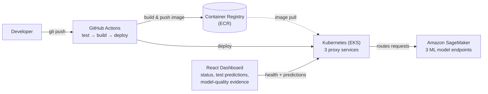
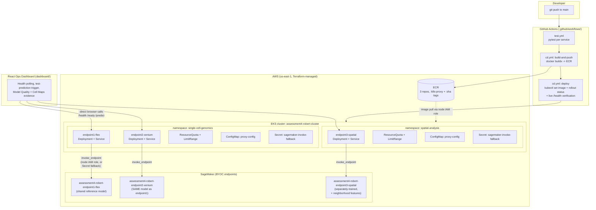

# Architecture

## Presentation overview (start here)

The simple version — what a reviewer needs on one slide. A draw.io file of this exact
diagram is at [`ARCHITECTURE-PRESENTATION.drawio`](ARCHITECTURE-PRESENTATION.drawio).

## Full detail (for Q&A / engineering reference)

Every namespace, ConfigMap, Secret and the 3 endpoints individually — useful when
someone asks "which namespace is which" or "how do credentials actually flow," not
for a slide. A draw.io version of THIS diagram (the dense one) is at
[`ARCHITECTURE.drawio`](ARCHITECTURE.drawio) — open it at
[app.diagrams.net](https://app.diagrams.net) (File → Open From → Device) or in the
draw.io VS Code extension for an easier-to-navigate, pan/zoomable view with the same
containers and connections.

**Explicit routing:** each proxy service reads its target SageMaker endpoint name from
its namespace's `ConfigMap` via an env var (`SAGEMAKER_ENDPOINT_NAME`) — a request to
`endpoint3-spatial` can only ever reach `assessment4-robert-endpoint3-spatial`, visible
directly in the manifest without opening any code.

**Credentials:** pods get AWS credentials primarily from the EKS node's IAM role (via
IMDS — see [Design Decisions](DESIGN_DECISIONS.md) for why hop-limit mattered here),
with a scoped-down (`sagemaker:InvokeEndpoint`-only, 3-endpoints-only) IAM user's keys
in a Kubernetes `Secret` as an explicit, code-level fallback if the primary path is
ever unavailable.

See [README.md](README.md) for the business scenario and endpoint details, and
[REPOSITORY_LAYOUT.md](REPOSITORY_LAYOUT.md) for what every file pictured above
actually is.
